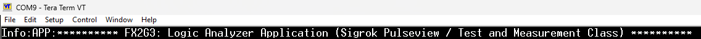
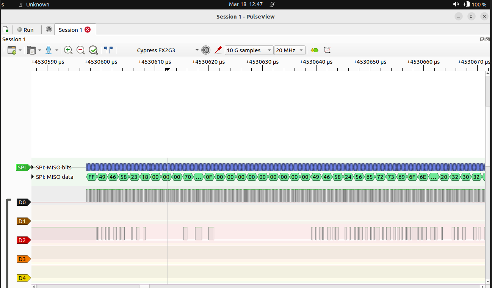
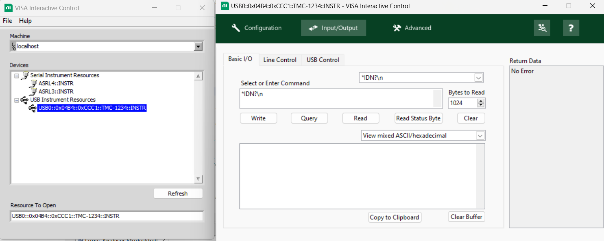
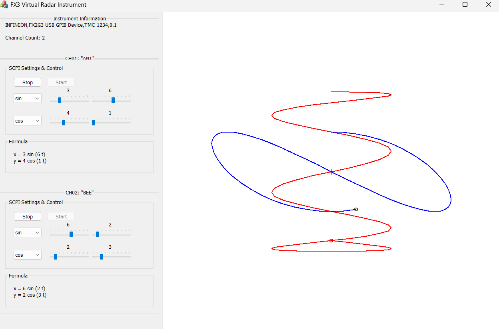

# EZ-USB&trade; FX2G3: Logic analyzer application

This code example demonstrates an application to capture and forward multiple logic signals from a digital system or digital circuit to a host device, which communicates with the PulseView application.

The application shows the configuration and usage of the Sensor Interface Port (SIP) on the EZ-USB&trade; FX2G3 device to implement the synchronous GPIF-to-USB protocol and integrates USB TMC with an open-source SCPI parser library and the Radar application, enabling operation of test instruments over USB.


[View this README on GitHub.](https://github.com/Infineon/mtb-example-fx2g3-logic-analyzer)

[Provide feedback on this code example.](https://cypress.co1.qualtrics.com/jfe/form/SV_1NTns53sK2yiljn?Q_EED=eyJVbmlxdWUgRG9jIElkIjoiQ0UyNDEwNzEiLCJTcGVjIE51bWJlciI6IjAwMi00MTA3MSIsIkRvYyBUaXRsZSI6IkVaLVVTQiZ0cmFkZTsgRlgyRzM6IExvZ2ljIGFuYWx5emVyIGFwcGxpY2F0aW9uIiwicmlkIjoic3VrdSIsIkRvYyB2ZXJzaW9uIjoiMS4wLjAiLCJEb2MgTGFuZ3VhZ2UiOiJFbmdsaXNoIiwiRG9jIERpdmlzaW9uIjoiTUNEIiwiRG9jIEJVIjoiV0lSRUQiLCJEb2MgRmFtaWx5IjoiSFNMU19VU0IifQ==)


## Requirements


- [ModusToolbox&trade;](https://www.infineon.com/modustoolbox) v3.5 or later (tested with v3.5)
- Board support package (BSP) minimum required version: 4.3.3
- Programming language: C
- Associated parts: [EZ-USB&trade; FX2G3](https://www.infineon.com/cms/en/product/promopages/ez-usb-fx2g3/)


## Supported toolchains (make variable 'TOOLCHAIN')

- GNU Arm&reg; Embedded Compiler v14.2.1 (`GCC_ARM`) – Default value of `TOOLCHAIN`
- Arm&reg; Compiler v6.22 (`ARM`)


## Supported kits (make variable 'TARGET')

- [EZ-USB&trade; FX2G3 DVK](https://www.infineon.com/cms/en/product/promopages/ez-usb-fx2g3/) (`KIT_FX2G3_104LGA`) – Default value of `TARGET`


## Hardware setup

This example uses the board's default configuration. See the kit user guide to ensure that the board is configured correctly.

This application does not require the FPGA add-on board and must be removed from the kit.


## Software setup

See the [ModusToolbox&trade; tools package installation guide](https://www.infineon.com/ModusToolboxInstallguide) for information about installing and configuring the tools package.

Install a terminal emulator if you do not have one. Instructions in this document use [Tera Term](https://teratermproject.github.io/index-en.html).

Install the **EZ-USB&trade; FX Control Center** application from [Infineon Developer Center](https://softwaretools.infineon.com/tools/com.ifx.tb.tool.ezusbfxcontrolcenter).

### Additional software 

- On Ubuntu, build and use the [PulseView application](./sigrok_build/README.md) from the [sigrok_build](./sigrok_build/) directory

- On Windows, install the NI-VISA application from the [NI-VISA download page](https://www.ni.com/en/support/downloads/drivers/download.ni-visa.html#565016)

- On Windows, use the [Radar application executable](./resources/fx_radar.exe) available in the [resources](./resources/) directory


## Using the code example

### Create the project

The ModusToolbox&trade; tools package provides the Project Creator as both a GUI tool and a command line tool.

<details><summary><b>Use Project Creator GUI</b></summary>

1. Open the Project Creator GUI tool

   There are several ways to do this, including launching it from the dashboard or from inside the Eclipse IDE. For more details, see the [Project Creator user guide](https://www.infineon.com/ModusToolboxProjectCreator) (locally available at *{ModusToolbox&trade; install directory}/tools_{version}/project-creator/docs/project-creator.pdf*)

2. On the **Choose Board Support Package (BSP)** page, select a kit supported by this code example. See [Supported kits](#supported-kits-make-variable-target)

   > **Note:** To use this code example for a kit not listed here, you may need to update the source files. If the kit does not have the required resources, the application may not work

3. On the **Select Application** page:

   a. Select the **Applications(s) Root Path** and the **Target IDE**

      > **Note:** Depending on how you open the Project Creator tool, these fields may be pre-selected for you

   b. Select this code example from the list by enabling its check box

      > **Note:** You can narrow the list of displayed examples by typing in the filter box

   c. (Optional) Change the suggested **New Application Name** and **New BSP Name**

   d. Click **Create** to complete the application creation process

</details>


<details><summary><b>Use Project Creator CLI</b></summary>

The 'project-creator-cli' tool can be used to create applications from a CLI terminal or from within batch files or shell scripts. This tool is available in the *{ModusToolbox&trade; install directory}/tools_{version}/project-creator/* directory.

Use a CLI terminal to invoke the 'project-creator-cli' tool. On Windows, use the command-line 'modus-shell' program provided in the ModusToolbox&trade; installation instead of a standard Windows command-line application. This shell provides access to all ModusToolbox&trade; tools. You can access it by typing "modus-shell" in the search box in the Windows menu. In Linux and macOS, you can use any terminal application.

The following example clones the "[mtb-example-fx2g3-logic-analyzer](https://github.com/Infineon/mtb-example-fx2g3-logic-analyzer)" application with the desired name "FX2G3_Logic_Analyzer" configured for the *KIT_FX2G3_104LGA* BSP into the specified working directory, *C:/mtb_projects*:

   ```
   project-creator-cli --board-id KIT_FX2G3_104LGA --app-id mtb-example-fx2g3-logic-analyzer --user-app-name FX2G3_Logic_Analyzer --target-dir "C:/mtb_projects"
   ```

The 'project-creator-cli' tool has the following arguments:

Argument | Description | Required/optional
---------|-------------|-----------
`--board-id` | Defined in the <id> field of the [BSP](https://github.com/Infineon?q=bsp-manifest&type=&language=&sort=) manifest | Required
`--app-id`   | Defined in the <id> field of the [CE](https://github.com/Infineon?q=ce-manifest&type=&language=&sort=) manifest | Required
`--target-dir`| Specify the directory in which the application is to be created if you prefer not to use the default current working directory | Optional
`--user-app-name`| Specify the name of the application if you prefer to have a name other than the example's default name | Optional

<br>

> **Note:** The project-creator-cli tool uses the `git clone` and `make getlibs` commands to fetch the repository and import the required libraries. For details, see the "Project creator tools" section of the [ModusToolbox&trade; tools package user guide](https://www.infineon.com/ModusToolboxUserGuide) (locally available at {ModusToolbox&trade; install directory}/docs_{version}/mtb_user_guide.pdf).

</details>


### Open the project

After the project has been created, you can open it in your preferred development environment.


<details><summary><b>Eclipse IDE</b></summary>

If you opened the Project Creator tool from the included Eclipse IDE, the project will open in Eclipse automatically.

For more details, see the [Eclipse IDE for ModusToolbox&trade; user guide](https://www.infineon.com/MTBEclipseIDEUserGuide) (locally available at *{ModusToolbox&trade; install directory}/docs_{version}/mt_ide_user_guide.pdf*).

</details>


<details><summary><b>Visual Studio (VS) Code</b></summary>

Launch VS Code manually, and then open the generated *{project-name}.code-workspace* file located in the project directory.

For more details, see the [Visual Studio Code for ModusToolbox&trade; user guide](https://www.infineon.com/MTBVSCodeUserGuide) (locally available at *{ModusToolbox&trade; install directory}/docs_{version}/mt_vscode_user_guide.pdf*).

</details>


<details><summary><b>Command line</b></summary>

If you prefer to use the CLI, open the appropriate terminal, and navigate to the project directory. On Windows, use the command-line 'modus-shell' program; on Linux and macOS, you can use any terminal application. From there, you can run various `make` commands.

For more details, see the [ModusToolbox&trade; tools package user guide](https://www.infineon.com/ModusToolboxUserGuide) (locally available at *{ModusToolbox&trade; install directory}/docs_{version}/mtb_user_guide.pdf*).

</details>


### Using this code example with specific products

By default, the code example builds for the `CYUSB2318-BF104AXI` product.


#### List of supported products

- `CYUSB2318-BF104AXI`

- `CYUSB2317-BF104AXI`

- `CYUSB2316-BF104AXI`

- `CYUSB2315-BF104AXI`


#### Setup for a different product

Perform the following steps to build this code example for a different, supported product:

1. Launch the BSP assistant tool:

   a. **Eclipse IDE:** Launch the **BSP Assistant** tool by navigating to **Quick Panel** > **Tools**

   b. **Visual Studio Code:** Select the ModusToolbox&trade; extension from the menu bar, and launch the **BSP Assistant** tool, available in the **Application** menu of the **MODUSTOOLBOX TOOLS** section from the left pane

2. In **BSP Assistant**, select **Devices** from the tree view on the left

3. Choose `CYUSB231x-BF104AXI` from the drop-down menu, on the right

4. Click **Save**

   This closes the **BSP Assistant** tool.

5. Navigate the project with the IDE's **Explorer** and delete the *GeneratedSource* folder (if available) at *`<bsp-root-folder>`/bsps/TARGET_APP_KIT_FX2G3_104LGA/config*

   > **Note:** For products `CYUSB2315-BF104AXI` and `CYUSB2316-BF104AXI`, additionally delete the `*.cyqspi` file from the config/ directory

6. Launch the **Device Configurator** tool

   a. **Eclipse IDE:** Select your project in the project explorer, and launch the **Device Configurator** tool by navigating to **Quick Panel** > **Tools**

   b. **Visual Studio Code:** Select the ModusToolbox&trade; extension from the left menu bar, and launch the **Device Configurator** tool, available in the **BSP** menu of the **MODUSTOOLBOX TOOLS** section from the left pane

7. Correct the issues (if any) specified in the **Errors** section on the bottom

   a. For a switch from the `CYUSB2318-BF104AXI` product to any other, a new upper limit of 100 MHz is imposed on the desired frequency that can originate from the PLL. Select this issue and change the desired frequency from 150 MHz to 75 MHz

   b. The `CLK_PERI` clock, which is derived from this new source frequency, is also affected. To restore it to its original frequency, go to the **System Clocks** tab, select `CLK_PERI`, and set its divider to '1' (instead of '2')

> **Note:** For the `CYUSB2315-BF104AXI` product, to enable UART logging through SCB, follow the steps below:<br>
a. Set the `USBFS_LOGS_ENABLE` macro to `0` in the **Makefile**<br>
b. In **main.c**, modify the SCB configuration by changing `LOGGING_SCB` from `(SCB4)` to `(SCB0)`, `LOGGING_SCB_IDX` from `(4)` to `(0)` and the value of `dbgCfg.dbgIntfce` from `CY_DEBUG_INTFCE_UART_SCB4` to `CY_DEBUG_INTFCE_UART_SCB0`<br>
c. Launch the Device Configurator tool to disable `SCB4`, and enable `SCB0` for UART. Set `921600` baud, `9` Oversample, and use the `16 bit Divider 0 clk` clock

## Compile-time configurations

This application's functionality can be customized by setting variables in *Makefile* or by configuring them through `make` CLI arguments.

- Run the `make build` command or build the project in your IDE to compile the application and generate a USB bootloader-compatible binary. This binary can be programmed onto the EZ-USB&trade; FX2G3 device using the EZ-USB&trade; FX Control Center application

- Run the `make build CORE=CM0P` command or set the variable in *Makefile* to compile and generate the binary for the Cortex&reg; M0+ core. By default, `CORE` is set as `CM4` and the binary is compiled and generated for the Cortex&reg; M4 core

- Choose between the **Arm&reg; Compiler** or the **GNU Arm&reg; Embedded Compiler** build toolchains by setting the `TOOLCHAIN` variable in *Makefile* to `ARM` or `GCC_ARM` respectively. If you set it to `ARM`, ensure to set `CY_COMPILER_ARM_DIR` as a make variable or environment variable, pointing to the path of the compiler's root directory

By default, the application is configured to receive data from a 16-bit wide LVCMOS interface in SDR mode and make a USBHS data connection. Additional settings can be configured through macros specified by the `DEFINES` variable in *Makefile*:

**Table 1. Macro description**

Flag name               | Description                                   | Allowed values
:-------------------    | :------------------------------------         | :-------------
USB_TMC                 | To build TMC application                      | "yes" to enable TMC app build <br> "no" to disable TMC app build
USB_LOGIC_ANALYZER      | To build Logic Analyzer application           | "yes" to enable the Logic Analyzer app build <br> "no" to disable the Logic Analyzer app build
USBFS_LOGS_ENABLE       | To enable debug logs through the USBFS port      | 1u for debug logs over USBFS <br> 0u for debug logs over UART (SCB4)
<br>


## Operation

> **Note:** This code example currently supports Windows hosts. Support for Linux and macOS will be added in upcoming releases.

1. Connect the board (J2) to your PC using the provided USB cable

2. Connect the USBFS port (J7) on the board to the PC for debug logs

3. Open a terminal program and select the Serial COM port. Set the serial port parameters to 8N1 and 921600 baud

4. Perform the following steps to program the board using the [**EZ-USB&trade; FX Control Center**](https://softwaretools.infineon.com/tools/com.ifx.tb.tool.ezusbfxcontrolcenter) application

   1. Perform the following steps to enter into the **Bootloader** mode:

      a. Press and hold the **PMODE** (**SW1**) switch<br>
      b. Press and release the **RESET** switch<br>
      c. Release the **PMODE** switch<br>

   2. Open **EZ-USB&trade; FX Control Center** application
      The **EZ-USB&trade; FX2G3** device displays as **EZ-USB&trade; FX BOOTLOADER**
      
      Once the firmware binary has been programmed onto the EZ-USB&trade; FX2G3 device flash, the bootloader will keep transferring control to the application on every subsequent reset. 
   
   3. To return control to the USB bootloader, press the **BOOT MODE/PMODE (SW1)** switch on the **KIT_FX2G3_104LGA DVK** while the device is being reset or power cycled – this keeps the device in bootloader mode instead of booting into the application

   4. Select the **EZ-USB&trade; FX BOOTLOADER** device in **EZ-USB&trade; FX Control Center** 

   5. Select **Program** > **Internal Flash**

   6. Navigate to *<CE Title>/build/APP_KIT_FX2G3_104LGA/Release* folder within the CE directory and locate the *.hex* file and program

   7. Confirm if the programming is successful in the log window of the **EZ-USB&trade; FX Control Center** application
   
5. After programming, the application starts automatically. Confirm that the following title is displayed on the UART terminal:

   **Figure 1. Terminal output on program startup**

   

6. Connect the device to the host with the PulseView application

   1. Connect the channels to the target device to measure,capture, or analyze
   2. Click **Start** to capture the signals and **Stop** to stop capturing
   3. 16 channels will support up to 20 MHz sampling rate, while 8 channels will support a 40 MHz sampling rate

      **Figure 2. PulseView application**

      
   
7. Connect the device to the host with the NI-VISA Interactive control application

   1. Click **Refresh** and double-click **USB0::0x04B4::0xCCC1::TMC-1234::INSTR**
   2. Select the **Input/Output** tab and select the ***IDN?\n** command
   3. Click **Write** and **Read**  
      The device returns to INFINEON,FX2G3\sUSB\sGPIB\sDevice,TMC-1234,0.1

      **Figure 3. NI-VISA Interactive Control application**

      

8. Connect the device to the host with the Radar application

   1. Run the Radar application
   2. Start CH01 and CH02
   3. Observe the plot of sine and cosine waveform generated for the set parameters

      **Figure 4. Radar application**

      

   
## Debugging

### Using the Arm&reg; debug port

You can debug the example to step through the code.


<details><summary><b>In Eclipse IDE</b></summary>

Use the **\<Application Name> Debug (KitProg3_MiniProg4)** configuration in the **Quick Panel**. For details, see the "Program and debug" section in the [Eclipse IDE for ModusToolbox&trade; user guide](https://www.infineon.com/MTBEclipseIDEUserGuide).


> **Note:** **(Only while debugging)** On the CM4 CPU, some code in `main()` may execute before the debugger halts at the beginning of `main()`. This means that some code executes twice – once before the debugger stops execution, and again after the debugger resets the program counter to the beginning of `main()`. See [KBA231071](https://community.infineon.com/docs/DOC-21143) to learn about this and for the workaround.

</details>


<details><summary><b>In other IDEs</b></summary>

Follow the instructions in your preferred IDE.

</details>

### Log messages

By default, the USBFS port is enabled for debug logs.

To enable debug logs on UART, set the `USBFS_LOGS_ENABLE` compiler flag to '0u' in the *Makefile* file. SCB4 of the EZ-USB&trade; FX2G3 device is used as UART with a baud rate of 921,600 to send out log messages through the P11.0 pin.

Debug the code example by setting debug levels for the UART logs. Set the `DEBUG_LEVEL` macro in the *main.c* file with the following values for debugging:

**Table 2. Debug values**

Macro value     |    Description
 :--------    | :-------------
 1u           | Enables only error messages
 2u           | Enables error and warning messages
 3u           | Enables error, warning, and info messages
 4u           | Enables all message types
<br>


## Design and implementation

The EZ-USB&trade; FX2G3 device is configured as the master and drives the IFCK required for the slave LVCMOS IP. The GPIF state machine samples LVMCOS Port 0 (16 bit, i.e., 1 channel per bit, for a total of 16 channels) and writes the sampled data to the DMA buffers.

The SCPI Parser library aims to provide the parsing ability of SCPI commands on the instrument side. The Radar application is to analyze the measured data from the instruments.


### Features of the application

- **USB specifications:** USB 2.0 (both Hi-Speed and Full-Speed)
- Supports write on both the GPIF threads, i.e., GPIF thread '0' and GPIF thread '1'


### Data streaming path

- The device enumerates as a vendor-specific USB device with the following endpoints:
  - One BULK endpoint (2-IN) for the sigrok logic analyzer application
  - One BULK endpoint (5-IN), one INT endpoint (6-IN), and another BULK endpoint (4-OUT), for the TMC application

- The logic analyzer application enables EP 2-IN with a maximum packet size of 512 bytes
- The device receives the data through the following data paths: <br>
  - **Datapath #1:** Data is received on LVCMOS Socket 0 (mapped to GPIF thread 0) and sent to EP 2-IN <br>
  - **Datapath #2:** Data is received on LVCMOS Socket 1 (mapped to GPIF thread 1) and sent to EP 2-IN
  
- The Test and Measurement Class application enables EP 4-OUT, EP 5-IN and EP 6-INTERRUPT
- The device receives the data through the following data paths: <br>
  - **Datapath #1:** Data is received on CY_HBDMA_VIRT_SOCKET_WR and sent to EP 5-IN <br>
  - **Datapath #2:** Data is received on CY_HBDMA_VIRT_SOCKET_WR and sent to EP 6-IN <br>
  - **Datapath #3:** Data is received on EP 4-OUT and processed

   > **Note:** With thread interleaving by default, the device receives the data through LVCMOS Socket 0 (mapped to GPIF thread 0) and LVCMOS Socket 1 (mapped to GPIF thread 1) in a ping pong way, and sends it on EP 2-IN. 

- Four DMA buffers sized 61440 bytes each are used in holding and forwarding the data to the USB


### Application workflow

The application flow involves three main steps:

   - Initialization 
   - USB device enumeration
   - Data transfers


#### Initialization

During initialization, the following steps are performed:

1. All required data structures are initialized

2. USBD and USB driver (CAL) layers are initialized

3. The application registers all descriptors supported by the function/application with the USBD layer

4. Application registers callback functions for different events, such as `RESET`, `SUSPEND`, `RESUME`, `SET_CONFIGURATION`, `SET_INTERFACE`, `SET_FEATURE`, and `CLEAR_FEATURE`. USBD calls the respective callback function when the corresponding events are detected

5. The data transfer state machines are initialized

6. The application registers handlers for all relevant interrupts

7. The application makes the USB device visible to the host by calling the Connect API

8. The application initializes the SIP block on the EZ-USB&trade; FX2G3 device as required by the selected LVCMOS operating mode


#### USB device enumeration

1. During USB device enumeration, the host requests for descriptors that are already registered with the USBD layer during the initialization phase

2. The host sends the `SET_CONFIGURATION` and `SET_INTERFACE` commands to activate the required function in the device

3. After the `SET_CONFIGURATION` and `SET_INTERFACE` commands, the application task takes control and enables the endpoints for data transfer


#### Data transfer

1. Depending on the compile-time options, LVCMOS interface and 16-bit bus width are selected
2. Data moves from the LVCMOS subsystem to the SRAM through high bandwidth DMA
3. The data is forwarded to the LOGIC_ANALYZER_BULK_IN_ENDPOINT_1. DataWire DMA channels are used in the case of USBHS transfers
4. Data moves from USB device BULK endpoint-IN to host application


### Modules/components

USB TMC class and SCPI are implemented to demonstrate the USBTMC SCPI compliance interface. It is effective in the analysis of data from test and measurement instruments.
Interfaces to SCPI and Radar are defined in the [*tmc_scpi.c*](./COMPONENT_TMC/src/tmc_scpi.c) and [*tmc_radar.c*](./COMPONENT_TMC/src/tmc_radar.c) files.

**Table 3. Module/component descriptions**

Module/components                   | Description   
:-------------                      | :------------                         
*TMC*                               | Defines USB TMC class and implementation
*SCPI*                              | SCPI parser (BSD 2 open source)
<br>


## Application files

**Table 4. Application file description**

File                                              | Description   
:-------------                                    | :------------                         
*gpif_header_interleaved.h*                       | Generated header file for GPIF state configuration for LVCMOS interface
*usb_app.c*                                       | C source file implementing the Logic Analyzer/TMC application logic
*usb_app.h*                                       | Header file for application data structures and functions declaration
*usb_descriptors.c*                               | C source file containing the USB descriptors
*main.c*                                          | Source file for device initialization, ISRs, and LVCMOS interface initialization, etc.
*cm0_code.c*                                      | CM0 initialization code
*Makefile*                                        | GNU make compliant build script for compiling this example
<br>


## Logic Analyzer GUI Application

This code example makes use of the [PulseView](https://sigrok.org/wiki/PulseView) GUI to capture the data captured in logic analyzer mode and to display it. The steps to build the `PulseView` GUI with support for this code example can be found in the `sigrok_build` folder.

## Related resources

Resources  | Links
-----------|----------------------------------
User guide | [EZ-USB&trade; FX2G3 SDK user guide](./docs/EZ-USB-FX2G3-SDK-User-Guide.pdf)
Code examples  | [Using ModusToolbox&trade;](https://github.com/Infineon/Code-Examples-for-ModusToolbox-Software) on GitHub
Device documentation | [EZ-USB&trade; FX2G3 datasheets](https://www.infineon.com/cms/en/product/promopages/ez-usb-fx2g3/#!?fileId=8ac78c8c90530b3a01909c03f29537e0)
Development kits | Select your kits from the [Evaluation board finder](https://www.infineon.com/cms/en/design-support/finder-selection-tools/product-finder/evaluation-board)
Libraries on GitHub | [mtb-pdl-cat1](https://github.com/Infineon/mtb-pdl-cat1) – Peripheral Driver Library (PDL) and documents
Middleware on GitHub  | [usbfxstack](https://github.com/Infineon/usbfxstack) – USBFXStack middleware library and documents
Tools  | [ModusToolbox&trade;](https://www.infineon.com/modustoolbox) – ModusToolbox&trade; software is a collection of easy-to-use libraries and tools enabling rapid development with Infineon MCUs for applications ranging from wireless and cloud-connected systems, edge AI/ML, embedded sense and control, to wired USB connectivity using PSOC&trade; Industrial/IoT MCUs, AIROC&trade; Wi-Fi and Bluetooth&reg; connectivity devices, XMC&trade; Industrial MCUs, and EZ-USB&trade;/EZ-PD&trade; wired connectivity controllers. ModusToolbox&trade; incorporates a comprehensive set of BSPs, HAL, libraries, configuration tools, and provides support for industry-standard IDEs to fast-track your embedded application development
<br>

### Compatibility information:
- This code example uses the PDL layer for direct communication with device peripherals, without relying on HAL peripheral APIs
- This code example relies on the USBFXStack middleware library for USBFS and does not support USBFS through the USB Device Middleware Library<br>
  
- [EZ-USB&trade; FX Control Center](https://softwaretools.infineon.com/tools/com.ifx.tb.tool.ezusbfxcontrolcenter) - EZ-USB™ FX Control Center is an desktop application that works in tandem with EZ-USB™ FX devices. The application is used for fetching device information, performing data transfers over USB endpoints, measure the USB data transfer performance and supports programming of the EZ-USB™ FX devices<br>    
- [EZ-USB&trade; GPIF III Designer](https://softwaretools.infineon.com/tools/com.ifx.tb.tool.ezusbgpifiiidesigner) - EZ-USB™ GPIF III Designer, a desktop application that guides the process of defining general programmable interface and state machine to generate C source header for FX device family<br>
- [EZ-USB&trade; Code Builder](https://softwaretools.infineon.com/tools/com.ifx.tb.tool.ezusbcodebuilder) - EZ-USB™ Code Builder is a Graphical User Interface (GUI) utility that helps generate a firmware project based on the selected parameters


## Other resources

Infineon provides a wealth of data at [www.infineon.com](https://www.infineon.com) to help you select the right device, and quickly and effectively integrate it into your design.


## Document history


Document title: *CE241071* – *EZ-USB&trade; FX2G3: Logic analyzer application*

 Version | Description of change
 ------- | ---------------------
 1.0.0   | New code example
<br>


All referenced product or service names and trademarks are the property of their respective owners.

The Bluetooth&reg; word mark and logos are registered trademarks owned by Bluetooth SIG, Inc., and any use of such marks by Infineon is under license.

PSOC&trade;, formerly known as PSoC&trade;, is a trademark of Infineon Technologies. Any references to PSoC&trade; in this document or others shall be deemed to refer to PSOC&trade;.

---------------------------------------------------------

(c) 2026, Infineon Technologies AG, or an affiliate of Infineon Technologies AG. All rights reserved.
This software, associated documentation and materials ("Software") is owned by Infineon Technologies AG or one of its affiliates ("Infineon") and is protected by and subject to worldwide patent protection, worldwide copyright laws, and international treaty provisions. Therefore, you may use this Software only as provided in the license agreement accompanying the software package from which you obtained this Software. If no license agreement applies, then any use, reproduction, modification, translation, or compilation of this Software is prohibited without the express written permission of Infineon.
<br>
Disclaimer: UNLESS OTHERWISE EXPRESSLY AGREED WITH INFINEON, THIS SOFTWARE IS PROVIDED AS-IS, WITH NO WARRANTY OF ANY KIND, EXPRESS OR IMPLIED, INCLUDING, BUT NOT LIMITED TO, ALL WARRANTIES OF NON-INFRINGEMENT OF THIRD-PARTY RIGHTS AND IMPLIED WARRANTIES SUCH AS WARRANTIES OF FITNESS FOR A SPECIFIC USE/PURPOSE OR MERCHANTABILITY. Infineon reserves the right to make changes to the Software without notice. You are responsible for properly designing, programming, and testing the functionality and safety of your intended application of the Software, as well as complying with any legal requirements related to its use. Infineon does not guarantee that the Software will be free from intrusion, data theft or loss, or other breaches (“Security Breaches”), and Infineon shall have no liability arising out of any Security Breaches. Unless otherwise explicitly approved by Infineon, the Software may not be used in any application where a failure of the Product or any consequences of the use thereof can reasonably be expected to result in personal injury.
